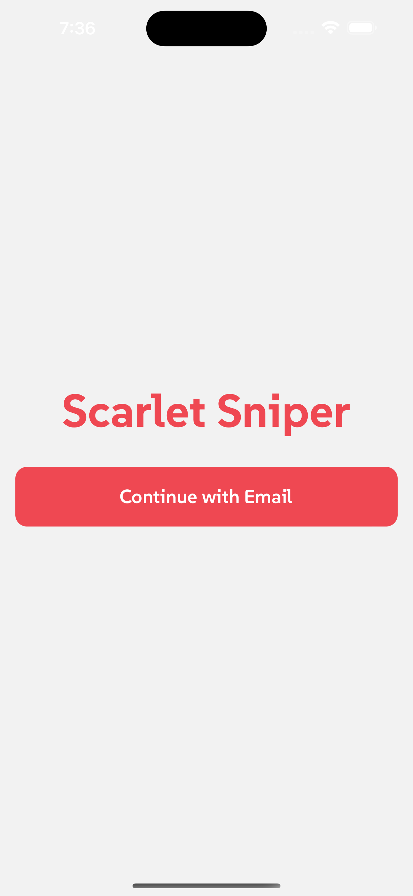
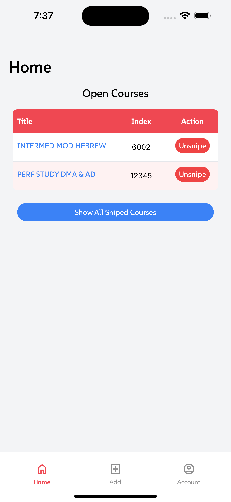

<p align="center">
    
</p>

<h1 align="center">Scarlet Sniper</h1>

Scarlet Sniper is a cross-platform mobile app that helps students with course registration. Rutgers University does not have a waitlist system for this process, which can make it challenging for students to secure a spot in popular classes. Scarlet Sniper addresses this issue by asynchronously calling the Rutgers API to check for course availability. When a spot opens up, the app sends a push notification to users, allowing them to quickly register for the course. This process helps improve the efficiency and experience of course registration for students.

## Screenshots

<p align="center">
    
    
</p>

## Table of Contents

- [Architecture](#architecture)
- [Getting Started](#getting-started)
- [Client](#client)
    - [Installation](#installation)
    - [Running the App](#running-the-app)
    - [Building the App](#building-the-app)
- [Server](#server)
    - [Installation](#installation-1)
    - [Running the Server](#running-the-server)
- [License](#license)
- [Disclaimer](#disclaimer)

## Architecture

Scarlet Sniper is built using the following technologies:

- **Client**: 
    - [React Native](https://reactnative.dev/)
    - [Expo](https://expo.dev/)
    - [Redux](https://redux.js.org/) for state management
    - [React Navigation](https://reactnavigation.org/) for navigation

- **Server**:
    - [Go](https://golang.org/) for the backend
    - [Gin](https://gin-gonic.com/) as the web framework
    - [MySQL](https://www.mysql.com/) for the database
    - [Redis](https://redis.io/) for caching

- **Push Notifications**:
    - [Firebase Cloud Messaging (FCM)](https://firebase.google.com/docs/cloud-messaging)

- **Deployment**:
    - [Docker](https://www.docker.com/) for containerization
    - [Kubernetes](https://kubernetes.io/) for orchestration
    - [Amazon Web Services (AWS)](https://aws.amazon.com/) for hosting

- **CI/CD**:
    - [GitHub Actions](https://github.com/features/actions) for continuous integration and deployment

## Getting Started

To get started with Scarlet Sniper, clone the repository and follow the instructions for setting up the client and server.

```sh
git clone https://github.com/yourusername/scarlet-sniper.git
cd scarlet-sniper
```

## Client

The client is built using [Expo](https://expo.dev) and React Native.

### Installation

Navigate to the `client` directory and install the dependencies:

```sh
cd client
npm install
```

### Running the App

To start the app, run:

```sh
npx expo start
```

In the output, you'll find options to open the app in a:

- [development build](https://docs.expo.dev/develop/development-builds/introduction/)
- [Android emulator](https://docs.expo.dev/workflow/android-studio-emulator/)
- [iOS simulator](https://docs.expo.dev/workflow/ios-simulator/)
- [Expo Go](https://expo.dev/go), a limited sandbox for trying out app development with Expo

### Building the App

To build the app for production, follow the Expo documentation on [building standalone apps](https://docs.expo.dev/distribution/building-standalone-apps/).

## Server

The server is built using Go.

### Installation

Navigate to the `server` directory and install the dependencies:

```sh
cd server
go mod download
```

### Running the Server

To start the server, run:

```sh
go run cmd/main.go
```

## License

Released under the MIT License. See [LICENSE](LICENSE) for details.

## Disclaimer

Scarlet Sniper is not affiliated, associated, authorized, endorsed by, or in any way officially connected with Rutgers University, or any of its subsidiaries or its affiliates.